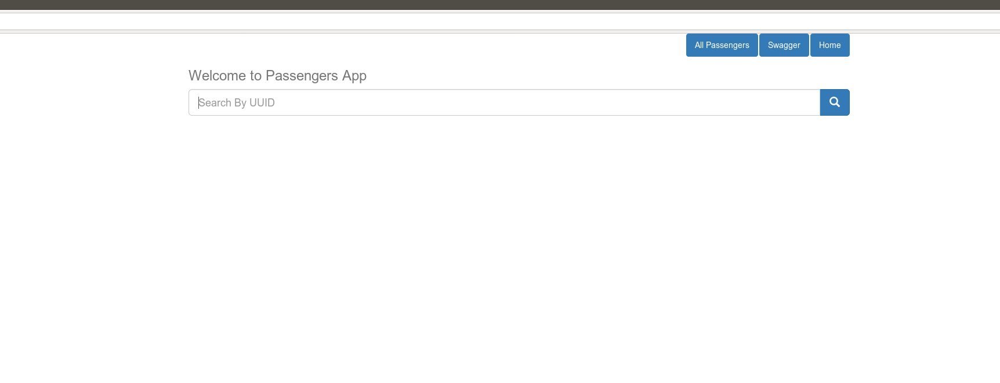
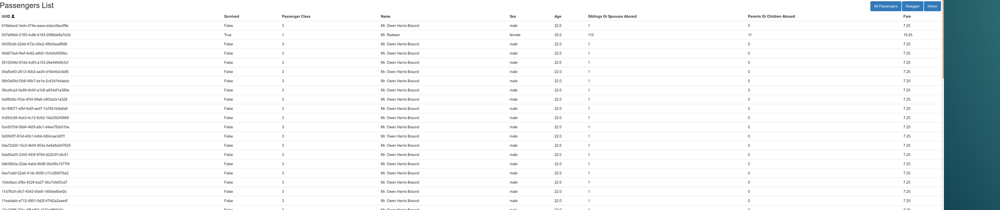
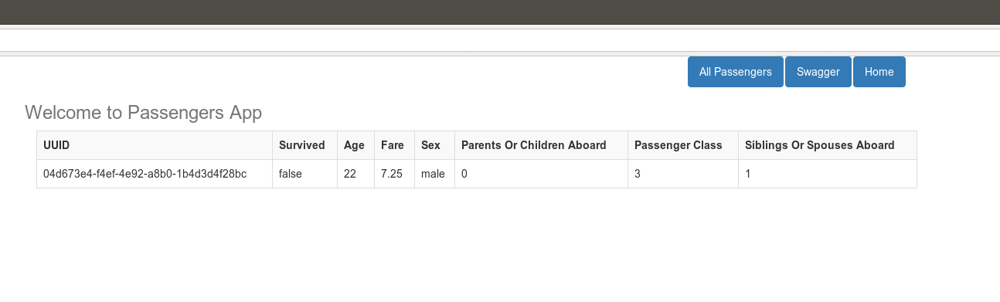
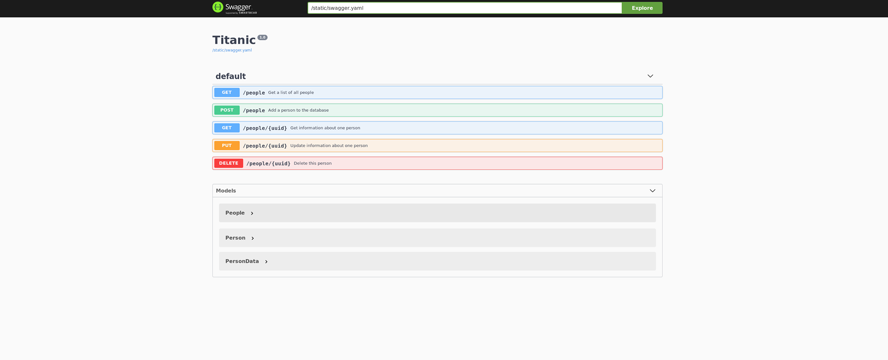

## Introduction

Project represents a soltuon API to read titanic passengers data from mysql DB , API is representd via 5 methods.

## Technologies

   * application is written in Python language using Flask library in order to obtain the API capabilities.
   * DB engine used is Mysql.
   * Used nginx as application server.
   * application is Docker based to run in 3 different docker containers. 

## Run

    $ docker-compose up -d

deployment command will apply the below steps:

   * start 3 new docker containers.
   * DB container will be launching the Mysql 5.7 service.
   * app container will start by installing all the required libraries included into app/requirements.txt file , and run the commands necessary to start the python application.
   * once app started it will create the necessary DB schema and fill the DB with he records included in the CSV file.
   * nginx latest release with necessary configuration files

## Command Line Testing
 ### to insert new record
	$ curl -v --request POST --url 'http://127.0.0.1/people' -H 'content-type: application/json' --data '{ "survived": false, "passengerClass": 3, "name": "Mr. Owen Harris Braund", "sex": "male", "age": 22, "siblingsOrSpousesAboard": 1, "parentsOrChildrenAboard":0, "fare":7.25}'

 ### to update existing record by UUID
	$ curl --request PUT --url http://127.0.0.1/people/04d673e4-f4ef-4e92-a8b0-1b4d3d4f28bc --header 'Content-Type: application/json' --data ' {"survived": true, "passengerClass": 1, "name": "Mr. Osama", "sex": "Male", "age": 25, "siblingsOrSpousesAboard": 110, "parentsOrChildrenAboard":11, "fare":19.25}'
 
 ### to select existing record  
	$ curl --request GET --url http://127.0.0.1/people/04d673e4-f4ef-4e92-a8b0-1b4d3d4f28bc --header 'Content-Type: application/json' 

 ### to select all records
	$ curl --request GET --url http://127.0.0.1/people --header 'Content-Type: application/json' 

 ### to delete existing record by UUID
	$ curl --request DELETE --url http://127.0.0.1/people/04d673e4-f4ef-4e92-a8b0-1b4d3d4f28bc --header 'Content-Type: application/json'   

## GUI Testing

open http://127.0.0.1:80 

### search page

### once you click on all passengers button

### return one record by UUID

### swagger 

## Deployment to Kubernetes

all the required deployment and service files are included at the /deployment directory , deployment files were all created via the KOMPOSE tool , passwords and relevant credentials are all stored in secret file managed by kubernetes secret service

 ### before you execute the below deployment command, make sure that container images were build and added to either locally or you docker registry
   
    $ kubectl create -f app-deployment.yaml,db-deployment.yaml,www-service.yaml,db-claim0-persistentvolumeclaim.yaml,db-service.yaml,www-deployment.yaml,secret.yaml
   
   #### check if pods are running 
    $ kubectl get pods
   
   #### check running services
    $ kubectl get svc
